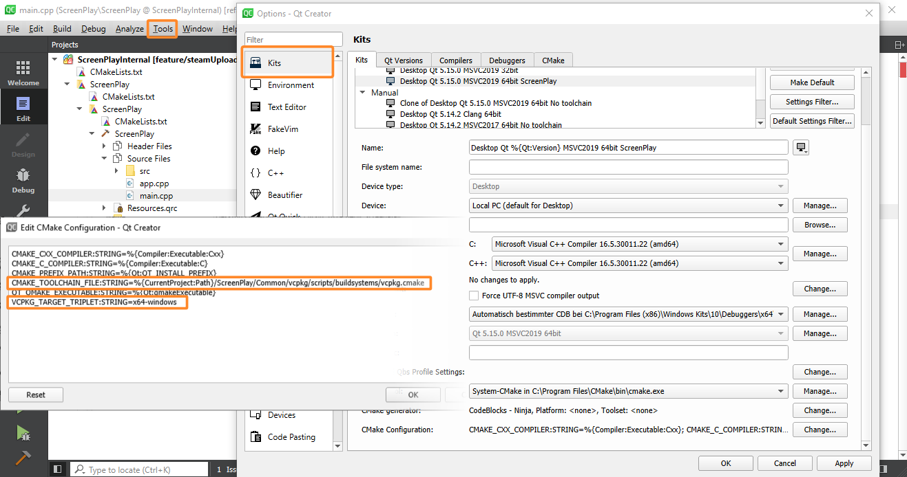
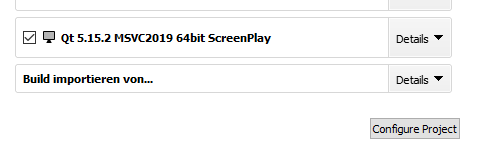

# Developer Setup
1. Install latest [git + git-lfs](https://git-scm.com/)
2. Clone ScreenPlay
``` bash
git clone --recursive https://gitlab.com/kelteseth/ScreenPlay.git ScreenPlay
```
3. Download the latest __Qt 5.15.x__ for you platform. Earlier versions are not supported!
    1. [Install instructions Windows](##Windows)
    1. [Install instructions Linux](##Linux)
    1. [Install instructions MacOSX](##MacOSX)
4. Start install-dependencies.bat to download dependencies. This will create a ScreenPlay-vcpkg folder in the same directory as your ScreenPlay source folder. 
``` bash
#Windows
cd Tools
.\install_dependencies_windows.bat

#Linux and MacOSX
cd Tools
chmod +x install_dependencies_linux_mac.sh
.\install_dependencies_linux_mac.sh
```
   * This will install these dependencies via __vcpkg__
      * openSSL 1.1.1d
      * sentry-native
      * doctest
   * Download ffmpeg binaries from https://www.gyan.dev
5. Open the CMakeLists.txt via QtCreator. **This can take some time until QtCreator parses all files!**

6. Add CMake variables
    * Add CMAKE_TOOLCHAIN_FILE and VCPKG_TARGET_TRIPLET
       * `Extras -> Tools -> Kits -> <Your Kit> -> CMake Configuration`
    
Append this:
``` bash
CMAKE_TOOLCHAIN_FILE:STRING=%{CurrentProject:Path}/../ScreenPlay-vcpkg/vcpkg/scripts/buildsystems/vcpkg.cmake
# Only _one_ of these lines that match your OS:
VCPKG_TARGET_TRIPLET:STRING=x64-windows
VCPKG_TARGET_TRIPLET:STRING=x64-linux
VCPKG_TARGET_TRIPLET:STRING=x64-osx
```
<div>

</div>

8. Save and close the settings.
9. Open Project via `File -> Open File or Project` and select your `CMakeLists.txt`. Then select __our created kit__, press `Configure Project`
<div>

</div>
9. Press build (the big green play button on the bottom left). This will compile and start ScreenPlay and copy all necessary files into your Qt installation.

## Windows
1. [Download and install the most recent MSVC 2019 Community](https://visualstudio.microsoft.com/vs/community/)
    - Select "Desktop development with C++"
2. [Download and install Qt 5 binary installer from qt.io](https://www.qt.io/download-qt-installer)
    - Install the Maintaince tool
    - Select the following features to install:
        - Qt 5.15.1
            - MSVC 2019 64-bit
            - Qt WebEngine
        - Developer and Designer Tools
            - Cmake
            - Ninja

## Linux
1. Install dependencies for your distro:
``` bash
# Debian/Ubuntu
sudo apt install build-essential libgl1-mesa-dev lld ninja-build cmake

# Fedora/RHEL/CentOS (yum)
sudo yum groupinstall "C Development Tools and Libraries"
sudo yum install mesa-libGL-devel

# openSUSE (zypper)
sudo zypper install -t pattern devel_basis
```
2. [Download and install Qt 5 binary installer from qt.io](https://www.qt.io/download-qt-installer)
    - Install the Maintaince tool
    - Select the following features to install:
        - Qt 5.15.2
            - GCC
            - Qt WebEngine
        - Developer and Designer Tools
            - OpenSSL 1.1.1.c Toolkit
                - OpenSSL 64-bit binaries
            - Cmake
            - Ninja
## MacOSX
1. [Download and install Qt 5 binary installer from qt.io](https://www.qt.io/download-qt-installer)
    - Install the Maintaince tool
    - Select the following features to install:
        - Qt 5.15.2
            - Qt WebEngine
        - Developer and Designer Tools
            - OpenSSL 1.1.1.c Toolkit
                - OpenSSL 64-bit binaries
            - Cmake
            - Ninja
2. Install [homebrew](https://brew.sh/)
     - Open a terminal and install clang -> brew install llvm cmake ninja
3. Change your default kit: QtCreator -> Options -> Kits -> Select your default kit (Desktop Qt 5.13.0) -> Change c and c++ Compiler to Apple Clang (x86_64)


# Developer docs 
We use qdoc to generate documentation. Qt6 is the minimum version qdoc, because of vastly improved c++ parsing support. 
* qdoc.exe configWindows.qdocconf
If you have installed Qt in a different directory, change the path to your Qt location.

Some useful links:
* [Introduction to QDoc](https://doc.qt.io/qt-5/01-qdoc-manual.html)
* [Writing qdoc comments](https://doc.qt.io/qt-5/qdoc-guide-writing.html)