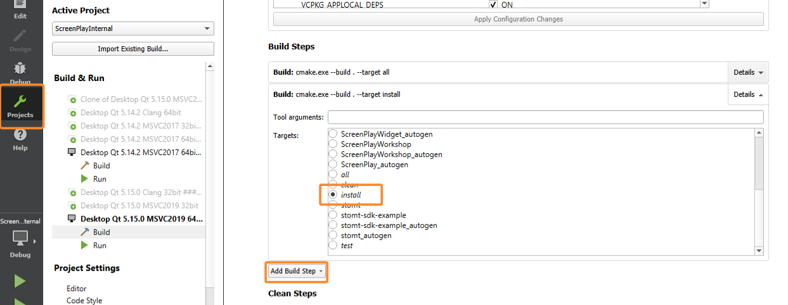

### Basic
1. Install latest [git + git-lfs](https://git-scm.com/)
2. Clone ScreenPlay
``` bash
git clone --recursive https://gitlab.com/kelteseth/ScreenPlay.git
```
3. Download the latest [__Qt 5.14__](https://www.qt.io/download-qt-installer). Earlier versions are not supported!
4. Start install-dependencies.bat to download dependencies into the Common/ folder
``` bash
//Windows
.\install-dependencies.bat

//Linux
sudo apt install git gcc cmake build-essential libgl1-mesa-dev
chmod +x install-dependencies.sh
.\install-dependencies.sh
```
   * This will install these dependencies via __vcpkg__
      * libzippp
      * nlohmann-json
      * openSSL 1.1.1d
      * zlib& libzip
      * breakpad 
   * Download these dependencies via __git submodules__
      * stomt-qt-sdk
      * qt-google-analytics
      * qt-breakpad
5. **Follow the steps below for your OS**. 
6. Open the CMakeLists.txt via QtCreator. **This can take some time until QtCreator parses all files!**
7. Add a second build step at: Projects -> Build -> Add Build Step -> Select Build -> Select "install" .

<div>

</div>

8. Add CMake variables
    * Add CMAKE_TOOLCHAIN_FILE and VCPKG_TARGET_TRIPLET
       * Extras -> Tools -> Kits -> <Your Kit> -> CMake Configuration -> Append this:
       * CMAKE_TOOLCHAIN_FILE:STRING=%{CurrentProject:Path}/Common/vcpkg/scripts/buildsystems/vcpkg.cmake
       * VCPKG_TARGET_TRIPLET:STRING=x64-windows
       * or  Linux: x64-linux MacOSX: x64-osx

<div>

</div>

9. Check if Ninja is selected
    * Extras -> Tools -> Kits -> <Your Kit> -> CMakeGenerator -> Change to:
        * Generator: Ninja
        * Extra Generator: CodeBlocks
10. Save and close the settings.
11. Press build (the big green play button). This will compile the project and copy all necessary files into your Qt installation.

### Windows
1. [Download and install MSVC 2019 Community](https://visualstudio.microsoft.com/vs/community/)
    - Select "Desktop development with C++"
2. [Download and install Qt 5 binary installer from qt.io](https://www.qt.io/download-qt-installer)
    - Install the Maintaince tool
    - Select the following features to install:
        - Qt 5.14.2
            - MSVC 2017 64-bit
            - Qt WebEngine
        - Developer and Designer Tools
            - Cmake
            - Ninja

### Linux
1. Install dependencies for your distro:
``` bash
# Debian/Ubuntu
sudo apt install build-essential libgl1-mesa-dev lld ninja-build cmake

# Fedora/RHEL/CentOS (yum)
sudo yum groupinstall "C Development Tools and Libraries"
sudo yum install mesa-libGL-devel

# openSUSE (zypper)
sudo zypper install -t pattern devel_basis
```
2. [Download and install Qt 5 binary installer from qt.io](https://www.qt.io/download-qt-installer)
    - Install the Maintaince tool
    - Select the following features to install:
        - Qt 5.14.2
            - GCC
            - Qt WebEngine
### OSX
1. [Download and install Qt 5 binary installer from qt.io](https://www.qt.io/download-qt-installer)
    - Install the Maintaince tool
    - Select the following features to install:
        - Qt 5.14.2
            - Qt WebEngine
        - Developer and Designer Tools
            - OpenSSL 1.1.1.c Toolkit
                - OpenSSL 64-bit binaries
            - Cmake
            - Ninja
2. Install [homebrew](https://brew.sh/)
     - Open a terminal and install clang -> brew install llvm
3. Change your default kit: QtCreator -> Options -> Kits -> Select your default kit (Desktop Qt 5.13.0) -> Change c and c++ Compiler to Apple Clang (x86_64)
