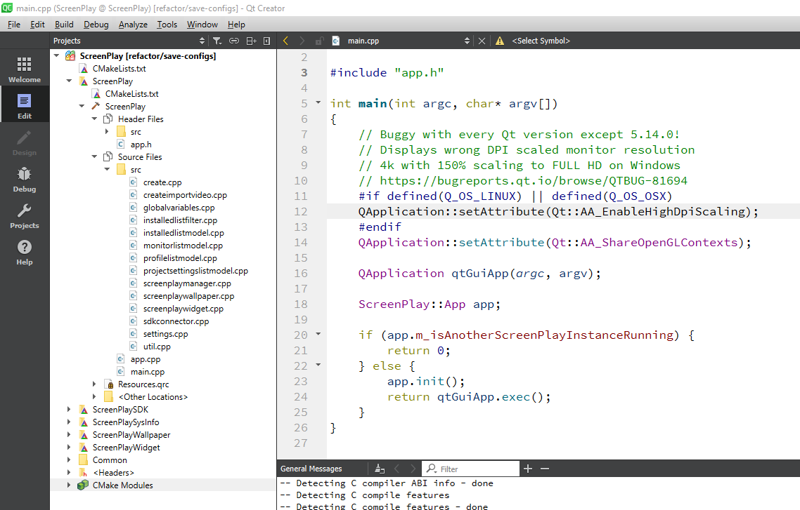
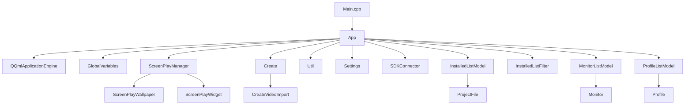

# Overview
ScreenPlay consists of 5 projects:
1. **ScreenPlay**
    * The main ScreenPlay App UI with Create, Installed, Community and Settings
2. **ScreenPlaySDK**
    * A SDK used internally in the ScreenPlayWallpaper and ScreenPlayWidget to talk to the main ScreenPlay app via QLocalsockets (Windows Pipes and Unix sockets)
3. **ScreenPlaySysInfo**
    * A qml plugin to read CPU, GPU, Network and all sort of statisitcs
4. **ScreenPlayWallpaper**
    * The Wallpaper executable that is used for displaying a single wallpaper. This uses ScreenPlaySDK to talk via QLocalsockets with the main ScreenPlayApp.
5. **ScreenPlayWidget**
    * The Widget executable that is used for displaying a single widget. This uses ScreenPlaySDK to talk via QLocalsockets with the main ScreenPlayApp .

### ScreenPlay classes

