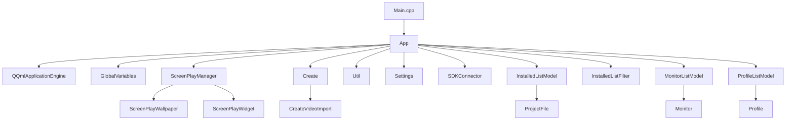

# Overview
ScreenPlay consists of 5 projects:
1. **ScreenPlay**
    * The main ScreenPlay App UI with Create, Installed, Community and Settings
2. **ScreenPlaySDK**
    * A SDK used internally in the ScreenPlayWallpaper and ScreenPlayWidget to talk to the main ScreenPlay app via QLocalsockets (Windows Pipes and Unix sockets)
3. **ScreenPlaySysInfo**
    * A qml plugin to read CPU, GPU, Network and all sort of statisitcs
4. **ScreenPlayWallpaper**
    * The Wallpaper executable that is used for displaying a single wallpaper. This uses ScreenPlaySDK to talk via QLocalsockets with the main ScreenPlayApp.
5. **ScreenPlayWidget**
    * The Widget executable that is used for displaying a single widget. This uses ScreenPlaySDK to talk via QLocalsockets with the main ScreenPlayApp .

### ScreenPlay App Class
ScreenPlay wrapps all classes into a App.h and App.cpp class. This is easier for unit test integration (not implemented yet!). The main app class is used for owning [all other classes via Q_PROPERTY](https://gitlab.com/kelteseth/ScreenPlay/-/blob/master/ScreenPlay/app.h#L39) to be easily accessible in the GUI/QML. We use the [constructor](https://gitlab.com/kelteseth/ScreenPlay/-/blob/master/ScreenPlay/app.cpp#L44) of the App class to initialize all Qt register types, fonts and to check if another ScreenPlay instance is running. The [init()](https://gitlab.com/kelteseth/ScreenPlay/-/blob/master/ScreenPlay/app.cpp#L103) method is used to initialize  all other c++ classes in a certain order! It also sets up some events [signal/slots](https://doc.qt.io/qt-5/signalsandslots.html) like when the user changes the UI language.

For all other class documentation please visit [ScreenPlayDeveloperDocs](https://kelteseth.gitlab.io/ScreenPlayDeveloperDocs/)

