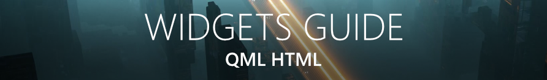

 

ScreenPlay:  Docs:      

<h3><a href="https://store.steampowered.com/app/672870/ScreenPlay/">✨Download ScreenPlay with via Steam with Workshop support✨</a> </h3> 
<h3><a href="http://gitlab.com/kelteseth/ScreenPlay/-/jobs/artifacts/master/download?job=build:windows_release">✨Download ScreenPlay Windows directly✨</a> </h3>
<h3><a href="http://gitlab.com/kelteseth/ScreenPlay/-/jobs/artifacts/master/download?job=build:osx_release">✨Download ScreenPlay macOS directly✨</a> </h3>

<!-- This works only on gitlab -->   <!-- This works only on github -->

<a href="https://www.youtube.com/watch?v=q-J2fTWDxw8">
Watch the Steam Early Access Trailer (YouTube)
</a> 

[中文总览](README_zh_CN.md)

ScreenPlay is an Open Source cross-platform app for displaying Video Wallpaper & Widgets. It is written in modern C++20/Qt5/QML.    <a href="https://screen-play.app/">Homepage</a> - <a href="https://forum.screen-play.app/">Forum</a>- <a href="https://discord.com/invite/4sY9d4f2DM">Discord</a> 

<h4><a href="https://www.patreon.com/ScreenPlayApp">🚀Support ScreenPlay On Patreon🚀</a> </h4>

# Important Issues
* [Implement KDE Support](https://gitlab.com/kelteseth/ScreenPlay/-/issues/111)

# Content Creation
[Learn the basics of QML for Wallpapers and Widgets in 5 minutes](https://screen-play.app/blog/guide_learn_the_basics_of_qml/)

* [Video Wallpaper](https://kelteseth.gitlab.io/ScreenPlayDocs/wallpaper/video_wallpaper/). You can import any WebM file directly or use the importer for any other video type.
* [Performance Guidelines](https://kelteseth.gitlab.io/ScreenPlayDocs/wallpaper/wallpaper/). You need a modern GPU for smooth playback. You can always use QML/HTML/GIF wallpaper if you encounter performance issues!
* [Video import via Handbrake](https://forum.screen-play.app/topic/43/fast-bulk-video-conversion-with-handbrake). Handbrake offers easy bulk import of videos.

* [Widgets Guide](https://kelteseth.gitlab.io/ScreenPlayDocs/widgets/widgets/). General guidelines how to create widgets. ScreenPlay uses the easy to learn QML language. No coding knowledge required!
* [Storage Widget](https://kelteseth.gitlab.io/ScreenPlayDocs/widgets/example_Storage/). Display your drives and usage.
* [CPU Usage Widget](https://kelteseth.gitlab.io/ScreenPlayDocs/widgets/example_CPU/). Displays your current CPU usage.
* [RSS Feed Widget](https://kelteseth.gitlab.io/ScreenPlayDocs/widgets/example_RSS/). Display news as a rss widget.

# General Contributing

Everyone can contribute with code, design, documentation or translation. Visit our [contributing guide](https://kelteseth.gitlab.io/ScreenPlayDocs/contribute/contribute) for more information. Also checkout our [Collaboration Guidelines](Docs/CodeOfConduct.md).

Here are some ways you can contribute:
* by using prerelease versions / master branch or the Steam nightly builds
* by [adding/fixing translation](https://crowdin.com/project/screenplay)
* by [designing UI/UX](https://kelteseth.gitlab.io/ScreenPlayDocs/contribute/contribute/#design)
* by [creating example HTML/QML/Javascript content](https://kelteseth.gitlab.io/ScreenPlayDocs/)
* by [reporting bugs](https://gitlab.com/kelteseth/ScreenPlay/-/issues)
* by [writing user documentation](https://gitlab.com/kelteseth/ScreenPlayDocs)
* by [coding needed features](https://gitlab.com/kelteseth/ScreenPlay/-/issues?label_name%5B%5D=Feature)
* by [refactoring code](https://gitlab.com/kelteseth/ScreenPlay/-/issues?label_name%5B%5D=Code+Quality)
* by [reviewing merge requests](https://gitlab.com/kelteseth/ScreenPlay/-/merge_requests)
* by [verifying issues](https://gitlab.com/kelteseth/ScreenPlay/-/issues?label_name%5B%5D=Unverified)

# Development
* [**Developer setup guide on how to download and compile ScreenPlay yourself.**](Docs/DeveloperSetup.md)
 * If you want to contribute but don't know how to start, take a look at our open issues and WIP merge request.
 * If you need help don't hesitate to ask me (Kelteseth) via:
     * [Create a forum topic with a detailed description](https://forum.screen-play.app/category/2/general-discussion)
     * [discord channel general](https://discord.gg/3RygPHZ)
 * [ScreenPlay project overview](Docs/ProjectOverview.md)
 * [Developer C++ Classes Documentation](https://kelteseth.gitlab.io/ScreenPlayDeveloperDocs/)

# Platform support

* ❌ Not working/Not implemented
* ❓ Only partially implemented/Not tested, help needed

| Feature                	    | Windows 	    | Linux 	        | MacOS 	|
|------------------------	    |---------	    |-------	        |-------	|
| __ScreenPlay Main App__       | ✔       	    | ✔     	        | ✔     	|
| __Steam Binaries__            | ✔       	    | ❌     	        | ✔    	|
| __Wallpaper__                 | ✔       	    | ❓ Help Needed for Gnome/KDE/etc!               | ✔    |
| __Widgets__                   | ✔       	    | ✔   	| ✔    	|
| __Multilanguage (EN,DE,RU,FR,ES,KO,VI,CH_ZN,PT_BR🆕)__              | ✔            	| ✔     	        |  ✔     	|

