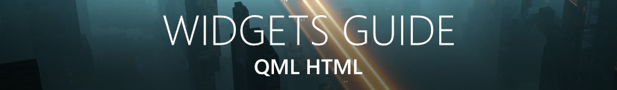

 

 
 
 
 

 

<a href="https://www.youtube.com/watch?v=q-J2fTWDxw8">
Watch the Steam Early Access Trailer (YouTube)
</a> 

[中文总览](README_zh_CN.md)

ScreenPlay is an Open Source cross-platform app for displaying Video Wallpaper & Widgets. It is written in modern C++23/Qt6/QML.    <a href="https://screen-play.app/">Homepage</a> - <a href="https://forum.screen-play.app/">Forums</a>- <a href="https://discord.com/invite/4sY9d4f2DM">Discord</a> 

## Table of Contents
- [Quick Start](#quick-start)
- [Content Creation](#content-creation)
- [General Contributing](#general-contributing)
- [Development](#development)
- [Platform Support](#platform-support)

## Quick Start

<h3><a href="https://kelteseth.gitlab.io/ScreenPlayDocs/building-screenplay/">Developer setup guide on how to download and compile ScreenPlay yourself.</a> </h3>

## ✨ Key Features

- 🎥 **Video Wallpapers** - Support for WebM, MP4 and other video formats
- 🎥 **Godot Engine Wallpapers** - Support for Godot 4 Wallpaper (🚀 Pro Feature)
- ⏰ **Timeline Wallpapers** - Automatically change wallpaper based on a user defined range (🚀 Pro Feature)
- 🖼️ **Static Wallpapers** - Beautiful image wallpapers with various effects
- 🎮 **Interactive QML Wallpapers** - Custom interactive wallpapers using Qt QML
- 🌐 **Web-based Wallpapers** - HTML/CSS/JavaScript wallpapers
- 🧩 **Desktop Widgets** - Customizable widgets for system monitoring, weather, RSS feeds, and more
- 🔧 **Cross-platform** - Works on Windows, macOS, and Linux
- 🎨 **Easy Content Creation** - No coding knowledge required for basic wallpapers
- 🛠️ **Steam Workshop** - Easy sharing and downloading of community content

# Content Creation
[Learn the basics of QML for Wallpapers and Widgets in 5 minutes](https://screen-play.app/blog/guide_learn_the_basics_of_qml/)

* [Wallpaper Documentation](https://kelteseth.gitlab.io/ScreenPlayDocs/wallpaper/). General wallpaper guidelines and information.
* [Performance Guidelines](https://kelteseth.gitlab.io/ScreenPlayDocs/wallpaper/). You need a modern GPU for smooth playback. You can always use QML/HTML/GIF wallpaper if you encounter performance issues!

* [Widgets Guide](https://kelteseth.gitlab.io/ScreenPlayDocs/widgets/). General guidelines how to create widgets. ScreenPlay uses the easy to learn QML language. No coding knowledge required!

# General Contributing

Everyone can contribute with code, design, documentation or translation. Visit our [contributing guide](https://kelteseth.gitlab.io/ScreenPlayDocs/contribute/) for more information. Also checkout our [Collaboration Guidelines](Docs/CodeOfConduct.md).

## 🚀 Quick Contributing Guide

**New to contributing?** Start here:
* 🐛 [Report bugs](https://gitlab.com/kelteseth/ScreenPlay/-/issues) - Help us improve by reporting issues
* 🌐 [Translate](https://crowdin.com/project/screenplay) - Make ScreenPlay available in your language  
* 💡 [Request features](https://gitlab.com/kelteseth/ScreenPlay/-/issues) - Share your ideas
* 🎨 [Create content](https://kelteseth.gitlab.io/ScreenPlayDocs/) - Make wallpapers and widgets

**For developers:**

* 🔧 [Fix bugs](https://gitlab.com/kelteseth/ScreenPlay/-/issues?label_name%5B%5D=Bug) - Help resolve existing issues
* ⭐ [Add features](https://gitlab.com/kelteseth/ScreenPlay/-/issues?label_name%5B%5D=Feature) - Implement new functionality
* 📚 [Improve docs](https://gitlab.com/kelteseth/ScreenPlayDocs) - Help other users and developers

# Platform support

* ✅ Fully supported
* ❌ Not working/Not implemented
* ❓ Partially implemented/Not tested (help needed)

| Feature                	    | Windows 	    | Linux (X11/Wayland) 	        | macOS 	|
|------------------------	    |---------	    |-------	        |-------	|
| **ScreenPlay Main App**       | ✅       	    | ✅     	        | ✅     	|
| **Binaries**                  | ✅       	    | ❌     	        | ✅    	|
| **Steam Binaries**            | ✅       	    | ❌     	        | ✅    	|
| **Video Wallpapers**          | ✅       	    | ✅   | ✅    |
| **QML/HTML Wallpapers**       | ✅       	    | ✅   | ✅    |
| **Desktop Widgets**           | ✅       	    | ✅   	| ✅    	|
| **Multi-monitor Support**     | ✅       	    | ✅   	| ✅    	|
| **Workshop Integration**      | ✅       	    | ❌   	| ✅    	|
| **Multilanguage Support** *(EN,DE,RU,FR,ES,KO,VI,ZH_CN,PT_BR)*     | ✅            	| ✅     	        |  ✅     	|

## ❓ Frequently Asked Questions

<strong>How do I install ScreenPlay?</strong>

- **Steam (Recommended)**: [Download from Steam](https://store.steampowered.com/app/672870/ScreenPlay/) for automatic updates and Workshop support
- **Direct Download (Non-Steam Version)**: 
  - [Latest Release](https://gitlab.com/kelteseth/ScreenPlay/-/releases) - Windows and macOS builds without Steam Workshop integration
  - [getsp.de](https://getsp.de/) - Alternative download source
  
*Note: Linux builds are coming soon! For community content downloads, visit our [forums](https://forum.screen-play.app/) where users share wallpapers and widgets.*

<strong>Why is my video wallpaper performance poor?</strong>

Video wallpapers require a modern GPU. If you experience performance issues:
- Try reducing the video resolution or bitrate
- Switch to QML or HTML wallpapers for better performance
- Check our [Performance Guidelines](https://kelteseth.gitlab.io/ScreenPlayDocs/wallpaper/)

<strong>How do I create my own wallpaper or widget?</strong>

- Check our [5-minute QML tutorial](https://screen-play.app/blog/guide_learn_the_basics_of_qml/)
- Read the [Wallpaper Documentation](https://kelteseth.gitlab.io/ScreenPlayDocs/wallpaper/)
- Browse the [Widgets Guide](https://kelteseth.gitlab.io/ScreenPlayDocs/widgets/)
- Look at example content in the `Content/` folder

<strong>Can I use ScreenPlay on multiple monitors?</strong>

Yes! ScreenPlay supports multi-monitor setups. You can set different wallpapers on each monitor and position widgets anywhere across your displays.

<strong>Where can I download wallpapers and widgets?</strong>

- **Steam Workshop**: If you use the Steam version, browse and download content directly through Steam Workshop
- **Community Forums**: Visit our [forums](https://forum.screen-play.app/) for user-shared content - many users prefer this for the direct download versions
- **Create Your Own**: Check our [content creation guides](https://kelteseth.gitlab.io/ScreenPlayDocs/) to make your own wallpapers and widgets

