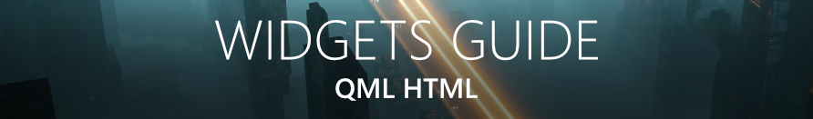

 

ScreenPlay   
开发文档     

  
用户交流 (Discord，英语)

开发者交流（英语） 

 
ScreenPlay 是一款开源、跨平台，显示视频壁纸，部件和桌面应用的软件。它以现代的 C++20/Qt5/QML编写。
带有创意工坊支持的二进制（在 Windows ，以及不久的 Linux 及 MacOSX 可用）可以通过<a href="https://store.steampowered.com/app/672870/ScreenPlay/">Steam</a>获取。加入我们（英语）：<a href="https://screen-play.app/">首页</a> - <a href="https://forum.screen-play.app/">论坛</a>

  
<h3><a href="https://store.steampowered.com/app/672870/ScreenPlay/">✨通过Steam下载ScreenPlay</a> - <a href="https://steamcommunity.com/app/672870/workshop/">Steam 创意工坊，获取壁纸与部件✨</a></h3> 
Windows only, Linux and MacOS (soon™)
 
 

 

点击gif，查看尽早访问预告片！ (YouTube)

# 内容创建

* [视频壁纸](https://kelteseth.gitlab.io/ScreenPlayDocs/wallpaper/video_wallpaper/) - 您可以直接导入任何WebM文件，
或者使用导入工具导入任何其他视频类型。
* [性能指南](https://kelteseth.gitlab.io/ScreenPlayDocs/wallpaper/wallpaper/) - 流畅的播放需要您有一块现代的显卡。如果您遇到性能问题，您可以一直用  QML/HTML/GIF 壁纸！
* [通过Handbrake导入视频](https://forum.screen-play.app/topic/43/fast-bulk-video-conversion-with-handbrake)。 Handbrake 提供了方便的视频批量导入。

* [部件引导](https://kelteseth.gitlab.io/ScreenPlayDocs/widgets/widgets/) - 通用引导，如何创建部件。
ScreenPlay使用易于学习的QML语言。无需任何编程知识！
* [Storage Widget](https://kelteseth.gitlab.io/ScreenPlayDocs/widgets/example_Storage/). Display your drives and usage.
* [CPU Usage Widget](https://kelteseth.gitlab.io/ScreenPlayDocs/widgets/example_CPU/). Displays your current CPU usage.
* [RSS Feed Widget](https://kelteseth.gitlab.io/ScreenPlayDocs/widgets/example_RSS/). Display news as a rss widget.

# General Contributing

Everyone can contribute with code, design, documentation or translation. Visit our [contributing guide](https://kelteseth.gitlab.io/ScreenPlayDocs/contribute/contribute) for more information. Also checkout our [Collaboration Guidelines](Docs/CodeOfConduct.md).

Here are some ways you can contribute:
* by using prerelease versions / master branch or the Steam nightly builds
* by [adding/fixing translation](https://kelteseth.gitlab.io/ScreenPlayDocs/contribute/translations/)
* by [designing UI/UX](https://kelteseth.gitlab.io/ScreenPlayDocs/contribute/contribute/#design)
* by [creating example HTML/QML/Javascript content](https://kelteseth.gitlab.io/ScreenPlayDocs/)
* by [reporting bugs](https://gitlab.com/kelteseth/ScreenPlay/-/issues)
* by [writing user documentation](https://gitlab.com/kelteseth/ScreenPlayDocs)
* by [coding needed features](https://gitlab.com/kelteseth/ScreenPlay/-/issues?label_name%5B%5D=Feature)
* by [refactoring code](https://gitlab.com/kelteseth/ScreenPlay/-/issues?label_name%5B%5D=Code+Quality)
* by [reviewing merge requests](https://gitlab.com/kelteseth/ScreenPlay/-/merge_requests)
* by [verifying issues](https://gitlab.com/kelteseth/ScreenPlay/-/issues?label_name%5B%5D=Unverified)

# Development
* [**Developer setup guide on how to download and compile ScreenPlay yourself.**](Docs/DeveloperSetup.md)
 * If you want to contribute but don't know how to start, take a look at our open issues and WIP merge request.
 * If you need help don't hesitate to ask me (Kelteseth) via:
     * [Create a forum topic with a detailed description](https://forum.screen-play.app/category/2/general-discussion)
     * [discord channel general](https://discord.gg/3RygPHZ)
 * [ScreenPlay project overview](Docs/ProjectOverview.md)
 * [Developer C++ Classes Documentation](https://kelteseth.gitlab.io/ScreenPlayDeveloperDocs/)

# Platform support

* ❌ Not working/Not implemented
* ❓ Only partially implemented/Not tested, help needed

| Feature                	    | Windows 	    | Linux 	        | MacOS 	|
|------------------------	    |---------	    |-------	        |-------	|
| __ScreenPlay Main App__       | ✔       	    | ✔     	        | ✔     	|
| __Steam Binaries__            | ✔       	    | ❌     	        | ❌     	|
| __Wallpaper__                 | ✔       	    | ❓ Help Needed for Gnome/KDE/etc!               | ✔    |
| __Widgets__                   | ✔       	    | ✔   	| ✔    	|
| __Multilanguage (EN,DE,RU,FR,ES,KO,VI,CH_ZN,PT_BR🆕)__              | ✔            	| ✔     	        |  ✔     	|

Because every operating system has its own version of desktop environment we need to adapt the ScreenPlayWindow for every platform 
separately. The most feature complete for now is Windows 10. Windows 7 works but the wallpaper have the [wrong coordinates](https://gitlab.com/kelteseth/ScreenPlay/issues/34). MacOS has some basic wallpaper functionality but no maintainer. For Linux we sadly have no support for any desktop environments at the moment, except basic KDE support.

__If you want to help and add new desktop environments look at ScreenPlayWallpaper/src folder__

* [BaseWindow](https://gitlab.com/kelteseth/ScreenPlay/blob/dev/ScreenPlayWallpaper/src/basewindow.h) baseclass for:
    * [LinuxWindow](https://gitlab.com/kelteseth/ScreenPlay/blob/dev/ScreenPlayWallpaper/src/linuxwindow.h)
    * [WinWindow](https://gitlab.com/kelteseth/ScreenPlay/blob/dev/ScreenPlayWallpaper/src/winwindow.h)
    * [MacWindow](https://gitlab.com/kelteseth/ScreenPlay/blob/dev/ScreenPlayWallpaper/src/macwindow.h)

| Plattform                	     | Windows 10  |   Gnome	         | KDE 	           	        | MacOS  	|
|------------------------	     |-------	   |---------	     |-------	                | -------	|
| __Wallpaper__                  | ✔           |❌ Help Needed!  | ❓ [Basic implementation](https://gitlab.com/kelteseth/ScreenPlay/-/tree/master/ScreenPlayWallpaper/kde/ScreenPlay)   | ❓ [Basic implementation](https://gitlab.com/kelteseth/ScreenPlay/-/blob/master/ScreenPlayWallpaper/src/MacBridge.mm)     	|

